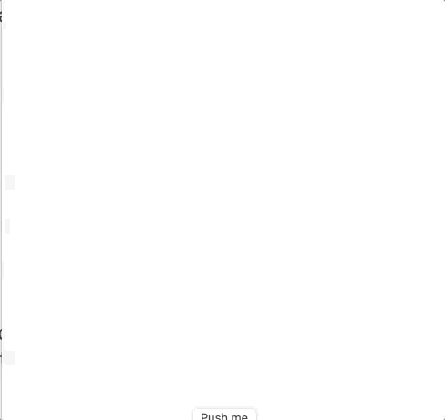

#RingChart

This project designed to explore the following SwiftUI features and patterns:
* Making a shape `Animatable`
* Extending `BinaryFloatingPoint`
* Extending `Path` with custom geometry
* Extending `Array where Element: BinaryFloatingPoint` to add `normalizedMagnitude`
* Using multiple previews to show partial animation
* Transforming coordinate spaces

